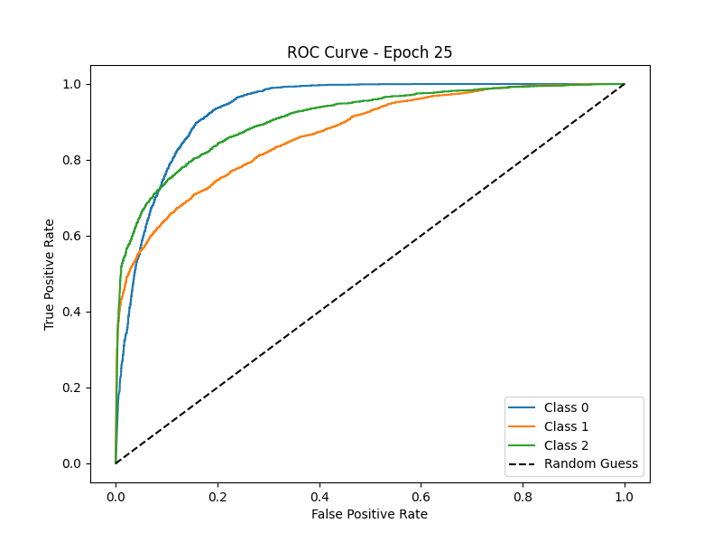
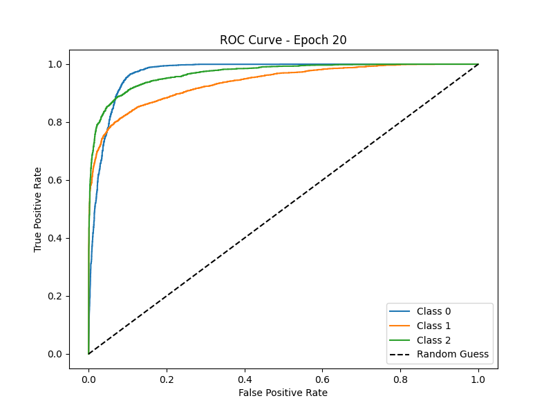
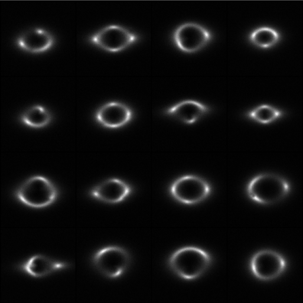
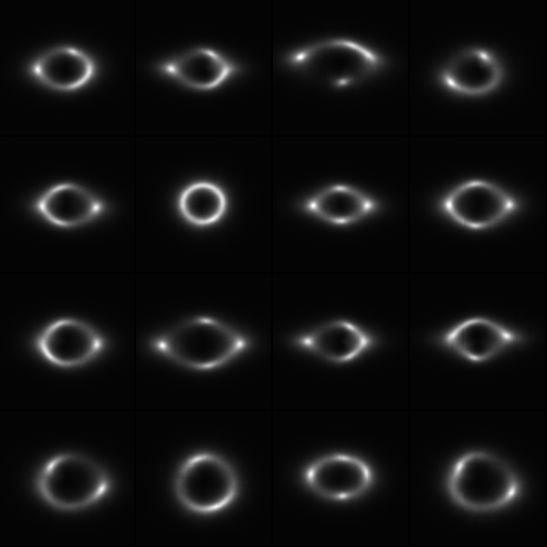

# 🌌 DeepLense Diffusion: Gravitational Lensing Synthesis
  

> **Google Summer of Code 2026 Submission** > A modular, Vision Transformer (JiT)-based Denoising Diffusion Probabilistic Model (JiT-DDPM) for generating high-fidelity gravitational lensing simulations.

---

## ✅ GSoC Submission Checklist & Deliverables
To facilitate a smooth review process, all officially requested deliverables are linked directly below:
* **Task 1 Implementation:** [`Task_1_results_and_demo_training.ipynb`](./Common_task_1/Task_1_results_and_demo_training.ipynb)
* **Task 7 Implementation:** [`Task_7_results_and_demo_training.ipynb`](./Task_7_Physics_Guided_ML/Task_7_results_and_demo_training.ipynb)
* **Task 8 Implementation:** [`Task_8_results_and_demo_training.ipynb`](./Task_8_Diffusion_Models/Task_8_results_and_demo_training.ipynb)
<!-- * **Trained Model Weights:** Available in the [GitHub Releases tab](../../releases/latest) (Includes `latest_checkpoint.pt` and `ema_model.pt`). -->
* **Evaluation Metrics:** Evaluated strictly on a **90:10 Train-Test split**. Results are documented below and fully reproducible via the notebooks.

---

## 📊 Results & Evaluation
*Note: Evaluation strategies were tailored to the data provided for each specific task. Tasks 1 and 7 were evaluated on their officially pre-separated validation sets for standard benchmarking. Task 8 (Diffusion) utilized a strict 90:10 manual Train-Test split to ensure rigorous out-of-distribution evaluation for the generative metrics.*

### Task 1: Baseline DeepLense Classification
* **Validation ROC-AUC Score:** `0.904`
* **Validation Accuracy:** `74.5%`

| Model Performance (ROC Curve) |
| :---: |
|  |


### Task 7: Physics-Guided Machine Learning (PINN)
* **Validation ROC-AUC Score:** `0.958`
* **Validation Accuracy:** `86.04%`

| Model Performance (ROC Curve) |
| :---: |
|  |


### Task 8: Denoising Diffusion Probabilistic Models (DDPM)
*Note: This task represents a standard, purely data-driven diffusion baseline. The integration of physics-guided constraints into this generative architecture is the primary focus of the proposed GSoC summer timeline.*
* **Fréchet Inception Distance (FID):** `74.27(final - epoch 700), 52.67(minimum - epoch 400)` *(Calculated dynamically mapping standard limits to a [-1, 1] range)*
* **Validation Denoising Loss (MSE):** `0.0217`

Efficiency Breakthrough: By utilizing the JiT architecture with x-prediction and v-loss, training is exceptionally fast. A full 700-epoch run converges in under 6 hours (at < 30-40 seconds per epoch). Traditional pixel-space DDPMs using ϵ-prediction on 150x150x1 datasets typically face severe convergence bottlenecks and memory overheads, making this pipeline highly optimal for rapid GSoC prototyping.
And setting up VAEs for Latent space causes a separate model to manage, usually requiring multiple losses. In comparison, a JiT can perform equivalently with much cleaner and elegant architecture and no extra auxiliary losses.
Also utilizes DDIM sampling (default 50 steps) for much faster sampling (and also faster FID calculation during training)

#### Visualizing the Generative Baseline (Task 8)
| Real Lenses (Test Set) | Generated Lenses (JiT-DDPM) |
| :---: | :---: |
|  |  |
*(Left: Ground truth data. Right: Unconditional samples generated from pure noise using the trained EMA model.)*


---

## 🏗️ Architectural Highlights
This repository is built with production-grade MLOps principles in mind, moving beyond static scripts into a fully modular pipeline:
* **Configuration as Code:** Driven by `Hydra`, completely decoupling hyperparameters (`patch_size`, `hidden_size`, `epochs`, etc.) from the Python logic.
* **Dynamic Factories:** Models, datasets, and noise schedules are instantiated dynamically via the corresponding \_\_init__.py of data/ models/ etc., ensuring zero hardcoded dependencies.
* **JiT-DDPM Backbone:** Utilizes the Just Image Transformer from the recent paper: [arXiv:2511.13720](https://arxiv.org/abs/2511.13720). It utilizes x-prediction combined with v-loss. x-pred instead of the standard epsilon loss makes training significantly faster (effectively the main point of the paper). More details in [Task 8 notebook](./Task_8_Diffusion_Models/)
* **Decoupled Training:** A standalone `Trainer` class handles Exponential Moving Average (EMA) weights, `MLflow` experiment tracking, and automated checkpointing.

---

## 📂 Repository Structure
```text
├── Common_task_1/               # Task 1 deliverables, notebooks, and results
├── Task_7_Physics_Guided_ML/    # Task 7 deliverables, notebooks, and PINN results
├── Task_8_Diffusion_Models/     # Task 8 deliverables, notebooks, and DDPM results
├── configs/                     # Hydra YAML configurations (model, training, dataset)
├── scripts/                     # Execution scripts
│   └── train.py                 # Main CLI execution script
├── src/                         # Core source code
│   ├── data/                    # Dataloaders and physics-aware normalization logic
│   ├── metrics/                 # Evaluation metrics (e.g., ROC_AUC calculation)
│   ├── models/                  # Model architecture implementations
│   │   ├── backbones/           # Core networks (e.g., JiT)
│   │   ├── losses/              # Objective functions for ddpm (V_loss, X_loss, Epsilon_loss)
│   │   └── utils/               # Model-specific helper modules
│   ├── noise_schedules/         # Diffusion noise scheduling (Linear, Cosine)
│   ├── sampling/                # Inference and reverse-diffusion generation loops
│   ├── training/                # Trainer class, EMA tracking, and optimization logic
│   └── utils/                   # General utility functions
└── requirements.txt             # Project dependencies
```
---

## 🚀 Quickstart & Reproducibility

This project uses [uv](https://docs.astral.sh/uv/) for fast, deterministic dependency management. 

### 1. Clone & Install
```bash
# Clone the repository
git clone https://github.com/JaniShreyas/ML4Sci-Deeplense-Diffusion.git
cd ML4Sci-Deeplense-Diffusion

# Sync the environment and install all dependencies instantly
uv sync
```

### 2. Dataset setup
Download the task specific datasets and add them under 
1. datasets/deeplense_classify (will contain dataset/ directory with train/ and val/ sub directories). This is for Task 1 and 7
2. datasets/deeplense_diffusion (will contain Samples/ subdirectory with all .npy images). This is for Task 8

### 3. Configuration
All hyperparameters, model architectures, and dataset paths are controlled via Hydra YAML files located in the ```configs/``` directory. You can edit these files directly or override them from the command line. 

### 4. Running the Pipeline
Execute the main training script using uv run. You can easily pass Hydra overrides to modify the run on the fly:
```bash
uv run -m scripts.train experiment_name=gsoc_eval training.epochs=50 model.backbone.hidden_size=128
```

### 5. Monitor training
Open another terminal and run
```bash
uv run mlflow ui
```
Then go to ```localhost:5000/``` for MLflow's gui
